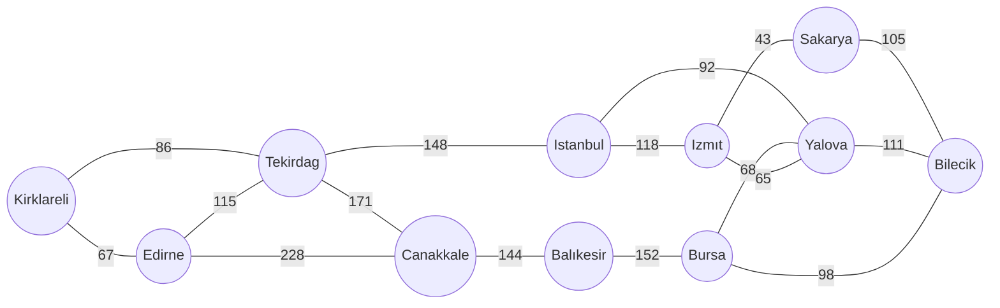

**Hasan ÖZER**
**2160656048**

# Dijkstra’s Shortest Path Algoritması
Dijkstra's algoritması, bir graph yapısındaki 2 node arasındaki en kısa mesafeyi; kısa süre, az işlem gücü, az step ile bulmamıza yarayan anlaşılması kolay algoritmalardan bir tanesidir.

Algoritmayı incelemeye başlamadan önce birkaç soru sormalıyız diye düşünüyorum.

#### Kodu yazmak için neler gerekiyor?
- Şehirler arası ilişkiler.
- Şehirler arası mesafeler.
- Başlangıç node'den hedef node'ye veya en fazla mesafeye sahip node'ye gidebilecek potansiyel yolların örnek uzayına adım adım ulaşmak.

#### Kod parçası bir graphı nasıl işleyecek?
- Bir kod parçası bir graphı, ancak ve ancak rakamlar üzerinden işleyebilir. Bu yüzden de en temelde işlenmesi gereken veri mesafe(cost) verileri olmalıdır.

#### Mesafe verisini kod ile nasıl işleyebiliriz?
 - Tümden gelim metoduyla Dijkstra’s Shortest Path algoritmasını anlamaya çalışalım. Varsayalım ki;
 - Başlangıç node'undan diğer tüm nodelere giden pathların örnek uzayına sahibiz.
 - Bu noktada örnek uzayı aklımızda canlandırdığımızda her şey doğrusaldır değil mi? Yani örnek uzayda 50km gittiğimizde ilk A şehri ile ilk defa karşılaştıysak A şehrine giden en kısa yol o an gittiğimiz yoldur ve en kısa mesafe de 50km'dir.
 - Farkettiysek örnek uzaya sahip olduğumuzda, işlediğimiz tek veri mesafe verisiydi. Kısacası graph, nodeler arasındaki bağıntılar, bir mesafe gidiyoruz ama sağa mı sola mı doğuya mı batıya mı gibi şeylerle uğraşmadık. Bu maddeyi aşağıdaki graph'a göre çizerek anlatmak gerekirse;
 

## Örnek Graph


- Kırklarelinden yola çıkıyoruz varsayalım. Kırklareline göre mesafeye bağlı örnek uzayımızın yaklaşık ilk 300 kmlik bölümü aşağıdaki gibi olacaktır. Vakit kaybetmemek adına yalnızca karşılaştığımız ilk nodelerin örnek uzayını çıkardım ve baktığımızda yaklaşık ilk 300km'lik bölümün örnek uzayını kapsıyor olarak görünüyor.

Kırklareli ---> (Başlangıçtan **86** km sonra) Tekirdag ---> (Başlangıçtan **86+148** km sonra) Istanbul 234
Kırklareli ---> (Başlangıçtan **86** km sonra) Tekirdag ---> (Başlangıçtan **86+171** km sonra) Canakkale 257
Kırklareli ---> (Başlangıçtan **86** km sonra) Tekirdag ---> (Başlangıçtan **86+115** km sonra) Edirne 201	
Kırklareli ---> (Başlangıçtan **67** km sonra) Edirne ---> (Başlangıçtan **67+115** km sonra)Tekirdag 182
Kırklareli ---> (Başlangıçtan **67** km sonra) Edirne ---> (Başlangıçtan **67+228** km sonra) Canakkale 295


Yukarıdaki resimde de göründüğü üzere Kırklareline en yakın node'i, en uzak node'i ya da bir node'in yakın mesafesini bulmak oldukça kolaylaştığını görebilmekteyiz. Örnek uzayı inceleyerek bazı çıkarımlarda bulunabiliriz.


- İlk karşılaştığımız noktalar(nodeler) aynı zamanda başlangıç nodesine en yakın nodelerdir.
- Örnek uzayda mesafe(cost) bazında pozitif yönde ilerlerken bir node'a ait karşılaştığımız ilk nokta, o node için bizim seçtiğimiz nodeye(kırklareli) en yakın mesafedir. Biraz daha detaylandırmak gerekirse; yukarıdaki resimde Tekirdağ nodesine hem yeşil hem de mor çizgi ile temsil edilen mesafelerde ulaşılmaktadır. Mesafe bazında pozitif ilerlerken ilk olarak yeşil çizgi Tekirdağ nodesine ulaşmıştır. Kırklareli nodesinden Tekirdağ nodesine en kısa mesafe 86km olarak yeşil çizgi ile işaretlenmiştir. **Bu bağlamda Örnek uzay üzerinde, mesafe bazında positif yönde ilerlerken, Tekirdağ nodesi ile ilk karşılaşmamızda Kırklareli nodesinden Tekirdağ nodesine giden en kısa mesafeyi de bulmuş oluyoruz.**
- Graph'taki tüm nodeleri ziyaret ettiğimizde, ziyaret edebileceğimiz başka node kalmadığında ulaştığımız mesafe(cost) belirtilen graph için başlangıç nodesi ve en uzak node arasındaki maksimum mesafe/uzaklık/cost değerine eşit olacaktır.

Bu çıkarımlara göre; tüme varım olarak düşünürsek, nodeler arası mesafeleri, doğrusal olarak işlemeye, örnek uzaya ilk adımda olmasa da adım adım ulaşmamız gerektiğini anlamaktayız.

## Adım adım Dijkstra’s Shortest Path algoritması'nı anlamak

- Öncelikle o an bulunduğumuz/ziyaret ettiğimiz node ile ilişkili olduğu diğer nodelerin arasındaki cost/mesafeleri ile ziyaret edilen nodenin başlangıç noktasına olan uzaklığı toplamını not almalıyız.
- Not aldığımız nodeler ve mesafeler arasından en yakın mesafeye sahip olan node'yi seçip o node'yi ziyaret etmeliyiz. Bu şekilde tüm nodeleri ziyaret edene kadar devam etmeliyiz.
- Her ziyaret ettiğimiz node'yi de not almalıyız. Bir nodeden ilişkili diğer nodeyi ziyaret ederken aynı şekilde ziyaret edilen nodeden bir önceki nodeye geri dönebiliriz.(yönlü graph olmadığı sürece.) Bunu önlemek adına ziyaret ettiğimiz her node'yi de not alıyoruz ve bir daha o node'i ziyaret etmiyoruz. Peki bir node'u ilk ziyaretimizden sonra tekrar tekrar farklı mesafelerle yine ziyaret etmek mümkün olabilir. İlk ziyaretimizin sonraki ziyaretlerimizden daha kısa mesafeye sahip olduğundan nasıl emin olabiliriz? Bu sorunun yanıtı aslında Dijkstra’s Shortest Path algoritmasının kendisinde saklı. Aslında bir başlangıç bir de hedef node belirtsek de bu algoritma en temelde resimdeki gibi bir kısmı tasfir edilen örnek uzayda pozitif yönde ilerleyerek başlangıç nodesindan itibaren, başlangıç nodesine en yakın nodeden en uzak nodeye doğru ilerler. Bu ilerleme esnasında hedef node'ye ulaşıldığında hedef node'ye en kısa mesafeyi bulmuşuz demektir. **Bu bağlamda bir node ile ilk karşılaştığımız anda başlangıç nodesinden o nodeye kadar olan mesafe, o nodenin başlangıç nodesine en yakın mesafesi demektir.**
- Hedef node'den bağımsız olarak tüm nodeler ziyaret edilip bittiğinde ise başlangıç noktasına en uzak node'i ve mesafeyi de bulmuş olmaktayız.

## Dijkstra’s Shortest Path algoritmasını koda dökmek
- Öncelikle graph'ı koda dökmemiz gerekmekte. Ve bu yapıyı kolay işleyebilmemiz de gerekiyor aynı zamanda. O halde Örnek Graph'ı koda dökelim.
```python
graph = {
	'Kirklareli': {'Edirne':67,'Tekirdag':50},
	'Edirne':{'Kirklareli':67,'Tekirdag':115,'Canakkale':228},
	'Tekirdag':{'Kirklareli':86,'Edirne':115,'Canakkale':171,'Istanbul':148},
	'Canakkale':{'Edirne':228,'Tekirdag':171,'Balikesir':144},
	'Istanbul':{'Tekirdag':148,'Izmit':118,'Yalova':92},
	'Balikesir':{'Bursa':152,'Canakkale':144},
	'Bursa':{'Balikesir':152,'Yalova':68,'Bilecik':98},
	'Yalova':{'Istanbul':92,'Izmit':65,'Bursa':68,'Bilecik':111},
	'Izmit':{'Istanbul':118,'Yalova':65,'Sakarya':43},
	'Bilecik':{'Sakarya':105,'Yalova':111,'Bursa':98},
	'Sakarya':{'Izmit':43,'Bilecik':105}
}
```
- Bir node'den diğer nodelere kolay ulaşabilmek adına, her node'yi key=>value formatında saklıyoruz.
- Ayrıca her node için gidebileceği ilişkili olduğu diğer nodeler ve o nodelere olan mesafelerini de saklıyoruz. Bu yapı sayesinde tüm graph'ı bir python dictionary array içerisinde saklama şansımız olmakta.
- Graph'ı kodumuz içerisinde sakladığımıza göre başlangıç noktasından her node için o node'nin mesafesini saklayan cost dizisini de tanımlayalım.

```python
costs = {
	'Kirklareli': 0,
	'Edirne': inf,
	'Tekirdag': inf,
	'Canakkale': inf,
	'Istanbul': inf,
	'Balikesir': inf,
	'Bursa': inf,
	'Yalova': inf,
	'Izmit': inf,
	'Bilecik': inf,
	'Sakarya': inf
}
```
- Başlangıç noktası olan kırklareli zaten kendisine uzaklığı 0 olduğu için kırklareli nodesi cost değerini "0" olarak tanımlıyoruz. Diğerlerini de henüz bilmediğimiz için ve mesafeler arasından en düşük mesafeyi ziyaret edeceğimiz için diğer tüm mesafeleri ilk başlangıçta sonsuz olarak tanımlıyoruz.

```python
parents = {}
```
- Bir de parents dizisi tanımlıyoruz bu dizide ise her ziyaret edilen node'u ve o node'nin parent'ini saklayacağız. Bu dizi sayesinde hedef node'a ulaşıp geriye dönük hedef node'a ulaşılana kadar izlenen yolu bulma imkaanı sağlayacağız.
```python
def search(source, target, graph, costs, parents):
    nextNode = source
    while nextNode != target:
        for neighbor in graph[nextNode]:
            if graph[nextNode][neighbor] + costs[nextNode] < costs[neighbor]:
                costs[neighbor] = graph[nextNode][neighbor] + costs[nextNode]
                parents[neighbor] = nextNode
            del graph[neighbor][nextNode]
        del costs[nextNode]
        nextNode = min(costs, key=costs.get)
        print(nextNode)
        print(costs)
    return parents
```
- Yukarıdaki fonksiyon vasıtasıyla source parametresi olarak verilen node'den başlayıp en yakın diğer nodelerden başlanarak uzak nodelere doğru taranarak target node'sine ulaşıldığında while döngüsü de sonlanacaktır.
```python
def backpedal(source, target, searchResult):
    node = target
    backpath = [target]
    path = []
    while node != source:
        backpath.append(searchResult[node])
        node = searchResult[node]
    for i in range(len(backpath)):
        path.append(backpath[-i - 1])
    return path
```
- Yukarıdaki fonksiyon vasıtasıyla search fonksiyonu ile oluşturduğumuz parents dizisi sayesinde geriye dönük olarak başlangıç nodesinden target node'sine doğru olan yolu bulabileceğiz.

- Kodu bir bütün olarak incelemek gerekirse;

```python
from numpy import inf
graph = {
	'Kirklareli': {'Edirne':67,'Tekirdag':50},
	'Edirne':{'Kirklareli':67,'Tekirdag':115,'Canakkale':228},
	'Tekirdag':{'Kirklareli':86,'Edirne':115,'Canakkale':171,'Istanbul':148},
	'Canakkale':{'Edirne':228,'Tekirdag':171,'Balikesir':144},
	'Istanbul':{'Tekirdag':148,'Izmit':118,'Yalova':92},
	'Balikesir':{'Bursa':152,'Canakkale':144},
	'Bursa':{'Balikesir':152,'Yalova':68,'Bilecik':98},
	'Yalova':{'Istanbul':92,'Izmit':65,'Bursa':68,'Bilecik':111},
	'Izmit':{'Istanbul':118,'Yalova':65,'Sakarya':43},
	'Bilecik':{'Sakarya':105,'Yalova':111,'Bursa':98},
	'Sakarya':{'Izmit':43,'Bilecik':105}
}
costs = {'Kirklareli': 0, 'Edirne': inf, 'Tekirdag': inf, 'Canakkale': inf, 'Istanbul': inf, 'Balikesir': inf, 'Bursa': inf, 'Yalova': inf, 'Izmit': inf, 'Bilecik': inf, 'Sakarya': inf}
parents = {}
def search(source, target, graph, costs, parents):
    nextNode = source
    #ziyaret edilecek node başlangıç için source olarak işaretleniyor.
    while nextNode != target:
    	#hedef node'a ulaşana kadar sonsuz döngü devam edecek.
        for neighbor in graph[nextNode]:
        	#ziyaret edilecek olarak işaretlenen başlangıç node'sinden başlanarak her while döngüsü iterasyonunda nextNode değişkenine set edilen nodenin ilişkili olduğu diğer nodeler for döngüsü ile her iterasyonda işlenir.
            if graph[nextNode][neighbor] + costs[nextNode] < costs[neighbor]:
            	#nextNode nodesinin başlangıç nodesine olan uzaklığı ile for döngüsünde işlenen nextNode nodesinin ilişkiği olduğu diğer nodelerin nextNode nodesine olan uzaklığı toplamı mesafeleri sakladığımız cost dizesinde tanımlı olan mesafeden az ise kod bloğu çalışır.
                costs[neighbor] = graph[nextNode][neighbor] + costs[nextNode]
                #daha az olan mesafe değeri tanımlanır.
                parents[neighbor] = nextNode
                #parent dizisine şuan itere edilen izlenen path eklenir.
            del graph[neighbor][nextNode]
            #graph dizisinden path tersine gidilmemesi için tam ters yol silinir.
        del costs[nextNode]
        #en küçük cost/mesafe şuan üzerinde bulunduğumuz nextNode'nin olacağı için diziden çıkarılır. aşağı satırdaki kodda en küçük cost değeri alınacaktır.
        nextNode = min(costs, key=costs.get)
        #en küçük cost değerine sahip olan node nextNode olarak seçilir.
    return parents
    #izlenen yol dönüş yapılır.
def backpedal(source, target, searchResult):
	#bu metod sayesinde parents değişkeninde izlenen yol geriye dönük olarak çözümlenir.
    node = target
    backpath = [target]
    path = []
    while node != source:
        backpath.append(searchResult[node])
        node = searchResult[node]
    for i in range(len(backpath)):
        path.append(backpath[-i - 1])
    return path

result = search('Kirklareli', 'Balikesir', graph, costs, parents)
print('parent dictionary={}'.format(result))
print('longest path={}'.format(backpedal('Kirklareli', 'Balikesir', result)))
```
## Kaynaklar
- https://likegeeks.com/python-dijkstras-algorithm/#Longest_Path_and_Maze_Solving
- https://www.freecodecamp.org/news/dijkstras-shortest-path-algorithm-visual-introduction/
